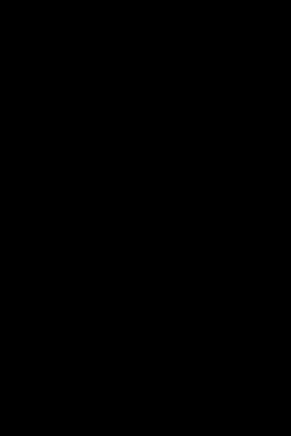

## jquery.bubble

一个基于jQuery的气泡动画插件，在指定区域上方（左/右）定时间隔产生气泡，然后随机水平速度进行仿自由落体运动。到达区域底部之后做弹跳运动，速度逐渐衰减。直至停止运动。



[在线演示](http://seejs.me/jquery.bubble/demo/)

### 安装方法

由于是基于jQuery的扩展插件，因此引入jQuery是必须的。
此外，还需引入插件自身的实现脚本。

```xml
<script src="https://code.jquery.com/jquery-1.12.4.min.js"></script>
<script src="../js/jquery.bubble.min.js"></script>
```

在此之前，我们还需要引入样式依赖文件`jquery.bubble.min.css`，主要包含气泡自身基础样式。

```css
<link rel="stylesheet" href="../css/jquery.bubble.min.css">
```

### 使用示例

插件会在指定的元素范围内运行，如果找不到指定的元素，插件将以body元素作为容器。

```js
$(function() {
    $('#J_PluginWrap').bubble({
        // 气泡元素Class
        itemClass: 'J_BubbleItem',
        // 气泡大小范围[最小值, 最大值]，单位px
        size: [60, 120],
        // 气泡吹大时间范围[最小值, 最大值]，单位s
        blowTime: [0.5, 1],
        // 气泡出现的方向，left/right
        direction: 'right',
        // 位置偏移量，[x, y]，效果与 direction 相关
        offset: [0, 60],
        // 气泡产生时间间隔，单位s
        interval: 1.2,
        // 自动停止的时间，为0则不停止，单位s
        autoStop: 10
    });
});
```

更多详细信息，请参看[源码](https://github.com/mailzwj/jquery.bubble)。